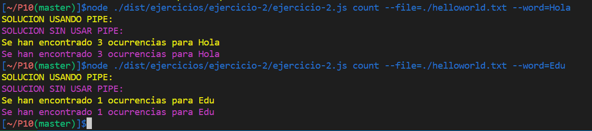
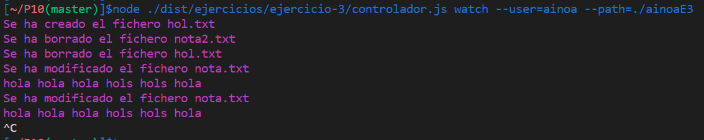
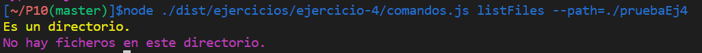
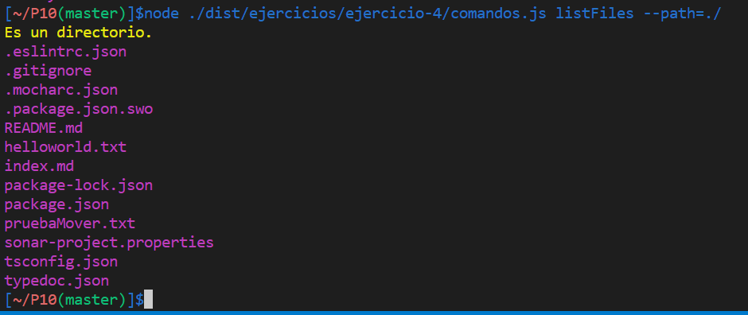
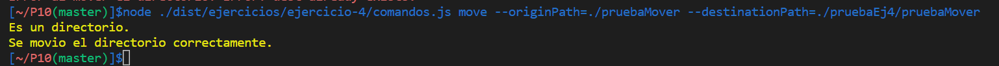

# PRÁCTICA 10. SISTEMAS DE FICHEROS Y CREACIÓN DE PROCESOS EN NODEJS

Asignatura: Desarrollo de sistemas informáticos

Curso: 3º, 2021/22

Ainoa Iglesias Dasilva, alu0101164403@ull.edu.es

#### EJERCICIO 1.

#### EJERCICIO 2.

Ejemplo de ejecución: 



Para este ejercicio se hace uso de yargs para obtener el nombre del fichero y la palabra de la que se quiere obtener el número de ocurrencias. Los dos parámetros se les pasa a dos funciones, una que hace uso de Pipe y otra que no usa Pipe.

```ts
yargs.command({
  command: 'count',
  describe: 'Count words',
  builder: {
    file: {
      describe: 'Filename',
      demandOption: true,
      type: 'string',
    },
    word: {
      describe: 'Word to search',
      demandOption: true,
      type: 'string',
    },
  },
  handler(argv) {
    if (typeof argv.file === 'string' && typeof argv.word === 'string') {
      countWordsPipe(argv.file, argv.word);
      countWords(argv.file, argv.word);
    }
  },
});

yargs.parse();
```

La primera función hace uso de Pipe. Primero se comprueba la existencia de la ruta dada. Tanto en esta función como la siguiente se contó la palabras usando el comando 'wc'. Se crean procesos con 'spawn' para los tres comandos (cat, grep y wc), cada uno con sus parámetros, el parámetro '-o' de 'grep' devuelve sólo la palabra buscada en tantas lineas como ocurrencias haya y el parátro '-l' en el comando 'wc' cuenta las lineas. Haciendo uso de 'pipe', se le pasa la entrada del comando 'grep' a la salida del comando cat, de esa forma solo devolverá la palabra buscada en tantas lineas como ocurrencias haya. Después se pasa la entrada del comando 'wc' a la salida del comando 'grep'. Depués haciendo uso del método 'on' del stream de wc se comprueba (pasando el dato a un string) que datos contiene, en este caso contendrá un numero (en string) que indicará el número de ocurrencias de la palabra buscada, si no se encuentra la palabra habrá almacenado un 0 y se lanza un mensaje indicandolo y el caso de encontrarse se lanza un mensaje indicando cuantas veces se encontró la palabra.

```ts
function countWordsPipe(nameFile: string, word: string): void {
  console.log(chalk.yellow('SOLUCION USANDO PIPE: '));
  if (fs.existsSync(`./${nameFile}`)) {
    const cat = spawn('cat', [nameFile]);
    const grep = spawn('grep', ['-o', word]);
    const wc = spawn('wc', ['-l']);
    cat.stdout.pipe(grep.stdin);
    grep.stdout.pipe(wc.stdin);
    // wc.stdout.pipe(process.stdout);
    wc.stdout.on('data', (data) => {
      if (data.toString().replace('\n', '') === '0') {
        console.log(chalk.yellow('No se han encontrado ocurrencias para la palabra seleccionada.'));
      } else {
        console.log(chalk.yellow('Se han encontrado ' + data.toString().replace('\n', '') + ` ocurrencias para ${word}`));
      }
    });
  } else {
    console.log(chalk.red('No se ha encontrado el fichero.'));
  }
}
```

La siguiente función no hace uso de 'pipe', eso complico un poco como se le pasaban los datos de un proceso a otro. Para hacerlo hice uso de los métodos 'on' de cada proceso de forma anidad para comprobar los datos de cada uno y pasarselos a los otros procesos. Por ejemplo, si ocurre que el comando 'grep' no encuentra la palabra, su proceso no contendrá datos por lo que se quedaría esperando, por lo que sie ncuentra datos se continúa haciendo uso del proceso 'wc' y si no se cierra el proceso y termina el programa sin encontrar ocurrencias para la palabra.

```ts
function countWords(nameFile: string, word: string): void {
  console.log(chalk.magenta('SOLUCION SIN USAR PIPE: '));
  if (fs.existsSync(`./${nameFile}`)) {
    const cat = spawn('cat', [nameFile]);
    cat.stdout.on('data', (dataCat) => {
      const grep = spawn('grep', ['-o', word]);
      grep.stdout.on('data', (dataGrep) => {
        const wc = spawn('wc', ['-l']);
        wc.stdout.on('data', (dataWc) => {
          console.log(chalk.magenta('Se han encontrado ' + dataWc.toString().replace('\n', '') + ` ocurrencias para ${word}`));
        });
        wc.stdin.write(dataGrep.toString());
        wc.stdin.end();
      });
      grep.on('close', (code) => {
        if (code === 1) {
          console.log(chalk.magenta('No se han encontrado ocurrencias para la palabra seleccionada.'));
        }
      });
      grep.stdin.write(dataCat.toString());
      grep.stdin.end();
    });
  } else {
    console.log(chalk.red('No se ha encontrado el fichero.'));
  }
}
```

#### EJERCICIO 3.

Ejemplo ejecución:



Para realizar este ejercicio, usé yargs para la obtención de datos por la consola, pidiendo un nombre de usuario y la ruta donde está la carpeta de dicho usuario. En este caso no hago ningún uso del nombre de usuario ya que se pasa la ruta completa del directorio. 

```ts
yargs.command({
  command: 'watch',
  describe: 'Control changes of directory.',
  builder: {
    user: {
      describe: 'User name.',
      demandOption: true,
      type: 'string',
    },
    path: {
      describe: 'Path directory of user.',
      demandOption: true,
      type: 'string',
    },
  },
  handler(argv) {
    if (typeof argv.path === 'string' && typeof argv.user === 'string') {
      watchDirectory(argv.user, argv.path);
    } else {
      console.log('Error en argv.');
    }
  },
});

yargs.parse();
```

Los dos parámetros se le pasan a una función donde se ejecuta la función fs.watch(), la cual recibe como argumentos del callBack el tipo de evento que se emite al realizarse un cambio y el nombre del fichero donde se realiza el cambio. Para saber que tipo de cambio se realiza, primero compruebo el parámetro 'event' el cual si es igual a 'rename' significa que se a creado o eliminado un fichero, en este caso compruebo después si el fichero en cuestión existe o no, si no existe significa que el cambio fué una eliminación y si existe es que se ha creado. En caso de ser un evento igual a 'changed' el fichero habrá sido modificado y haciendo uso de la función fs.readFileSync() leo el contenido del mismo y lo muestro. En el caso de crear un fichero nuevo, lo normal es que se cree primero el fichero sin contenido por lo que no se mostrarán datos del mismo, si s¡por ejemplo se crea haciendo uso del comando 'echo' el sistema primero detecta la creación del nuevo fichero y depués una modificación del mismo.

```ts
export function watchDirectory(user: string, path: string): void {
  if (fs.existsSync(path)) {
    fs.watch(path, (event, filename) => {
      if (event === 'change') {
        console.log(chalk.magenta('Se ha modificado el fichero', filename));
        const dataFile = fs.readFileSync(path+'/'+filename, 'utf-8');
        console.log(chalk.magenta(dataFile.toString()));
      }
      if (event === 'rename') {
        if (fs.existsSync(path+'/'+filename)) {
          console.log(chalk.magenta('Se ha creado el fichero', filename));
          const dataFile = fs.readFileSync(path+'/'+filename, 'utf-8');
        console.log(chalk.magenta(dataFile.toString()));
        } else {
          console.log(chalk.magenta('Se ha borrado el fichero', filename));
        }
      }
    });
  } else {
    console.log(chalk.red('No se ha encontrado la ruta especificada'));
  }
}
```

Preguntas:
- El objeto watcher emite un evento 'changed' cuando se modifica un fichero y un evento 'rename' cuando se crea o elimina.

- Para observar varios directorio se puede poner la opción {recursive: true} al fs.watch o puede listarse todos los directorio y ponerles un objeto watcher a cada uno.


#### EJERCICIO 4.

Para este ejercicio hice uso de yargs para los comandos y parámetro pasados por consola y creé una clase que contiene los métodos del Wrapper.

Código de yargs:

```ts
const wrapper: Wrapper = new Wrapper();

yargs.command({
  command: 'type',
  describe: 'Tell if is file or directory.',
  builder: {
    path: {
      describe: 'Path file/directory.',
      demandOption: true,
      type: 'string',
    },
  },
  handler(argv) {
    if (typeof argv.path === 'string') {
      wrapper.whatType(argv.path);
    } else {
      console.log('Error en argv.');
    }
  },
});

yargs.command({
  command: 'newDirectory',
  describe: 'Create a new directory on a given path.',
  builder: {
    path: {
      describe: 'Path directory.',
      demandOption: true,
      type: 'string',
    },
    name: {
      describe: 'Name directory.',
      demandOption: true,
      type: 'string',
    },
  },
  handler(argv) {
    if (typeof argv.path === 'string' && typeof argv.name === 'string') {
      wrapper.newDirectory(argv.path, argv.name);
    } else {
      console.log('Error en argv.');
    }
  },
});

yargs.command({
  command: 'listFiles',
  describe: 'List filenames in a directory.',
  builder: {
    path: {
      describe: 'Path directory.',
      demandOption: true,
      type: 'string',
    },
  },
  handler(argv) {
    if (typeof argv.path === 'string') {
      wrapper.listFiles(argv.path);
    } else {
      console.log('Error en argv.');
    }
  },
});

yargs.command({
  command: 'cat',
  describe: 'Show the content of a file.',
  builder: {
    path: {
      describe: 'Path file.',
      demandOption: true,
      type: 'string',
    },
  },
  handler(argv) {
    if (typeof argv.path === 'string') {
      wrapper.catFile(argv.path);
    } else {
      console.log('Error en argv.');
    }
  },
});

yargs.command({
  command: 'delete',
  describe: 'Delete a directory or file.',
  builder: {
    path: {
      describe: 'Path directory/file.',
      demandOption: true,
      type: 'string',
    },
  },
  handler(argv) {
    if (typeof argv.path === 'string') {
      wrapper.delete(argv.path);
    } else {
      console.log('Error en argv.');
    }
  },
});

yargs.command({
  command: 'move',
  describe: 'Move a directory or file from one path to another.',
  builder: {
    originPath: {
      describe: 'Path directory/file origin.',
      demandOption: true,
      type: 'string',
    },
    destinationPath: {
      describe: 'Path directory/file destination.',
      demandOption: true,
      type: 'string',
    },
  },
  handler(argv) {
    if (typeof argv.originPath === 'string' && typeof argv.destinationPath === 'string') {
      wrapper.move(argv.originPath, argv.destinationPath);
    } else {
      console.log('Error en argv.');
    }
  },
});

yargs.command({
  command: 'copy',
  describe: 'Copy a directory or file from one path to another.',
  builder: {
    originPath: {
      describe: 'Path directory/file origin.',
      demandOption: true,
      type: 'string',
    },
    destinationPath: {
      describe: 'Path directory/file destination.',
      demandOption: true,
      type: 'string',
    },
  },
  handler(argv) {
    if (typeof argv.originPath === 'string' && typeof argv.destinationPath === 'string') {
      wrapper.copy(argv.originPath, argv.destinationPath);
    } else {
      console.log('Error en argv.');
    }
  },
});

yargs.parse();
```

Para la clase wrapper el contructor no recibe nada ni es necesario atributos, los datos se pasan a cada funcón. 

El primer método comprueba si la ruta dada pertenece a un fichero o directorio, para ello primero se comprueba la existencia de la ruta y luego usando 'fs.lstatSync' se comprueba si es directorio o fichero, como hice uso de esta función en la siguientes, retorna 0, 1 o -1 según si es directorio, fichero o no encuentra la ruta.

```ts
export class Wrapper {
  constructor() {}

  public whatType(path: string): number {
    if (fs.existsSync(path)) {
      if (fs.lstatSync(path).isDirectory()) {
        console.log(chalk.yellow('Es un directorio.'));
        return 0;
      }
      if (fs.lstatSync(path).isFile()) {
        console.log(chalk.yellow('Es un fichero.'));
        return 1;
      }
    } else {
      console.log(chalk.red('ERROR.La ruta dada no existe.'));
    }
    return -1;
  }
```

Para el método que crea un directorio, primero se hace uso de la función anterior para comprobar que la ruta pasada pertene a un directorio (retun 0), en caso de no exitir, el método anterior ya lanza un mensaje y este método no hará nada y termina el programa. También se hace una comprobación de que no existe ya un directorio en la ruta dada que contenga el nombre de este nuevo directorio, en caso de que si exista se mostrará un mensaje diciendolo y no hará nada más el programa, si no lo encuentra, haciendo uso de 'fs.mkdirSync()' se crea el directorio.

```ts
 public newDirectory(path: string, name: string): void {
    const type: number = this.whatType(path);
    const type2: number = this.whatType(path+'/'+name);
    // si la ruta es de un directorio y no hay directorios con ese nombre
    if (type === 0 && (type2 === -1 || type2 === 1)) {
      fs.mkdirSync(path+'/'+name);
      console.log(chalk.magenta('Se ha creado el directorio correctamente.'));
    } else {
      if (type2 === 0) {
        console.log(chalk.magenta('Ya existe un directorio con ese nombre.'));
      }
    }
  }
```

El siguiente método muestra el nombre de los ficheros de un directorio en caso de haberlos. Primero se hace comprobación de que existe la ruta y de que pertenece a un directorio, si es así, se lee su contenido con la función asíncrona 'fs.readdir()' y si no hay problemas en la lectura se comprueba para cada cada dato si es un fichero y en caso de serlo muestra su nombre por pantalla, si no hay datos mostrará un mensaje indicándolo.

```ts
public listFiles(path: string): void {
    const type: number = this.whatType(path);
    if (type === 0) {
      fs.readdir(path, (err, files) => {
        if (err) {
          console.log(chalk.yellow('Error: ', err));
        } else {
          if (files.length === 0) {
            console.log(chalk.magenta('No hay ficheros en este directorio.'));
          } else {
            files.forEach(function(file) {
              if (fs.lstatSync(path+'/'+file).isFile()) {
                console.log(chalk.magenta(file));
              }
            });
          }
        }
      });
    }
  }
```

Ejemplo de ejecucion de listar:





Para mostrar el contenido de un fichero, al igual que en el resto de método se hace comprobación de que existe la rura y de que pertenece a un fichero, si es así, se lee el contenido del fichero y se muestra por al consola.

```ts
  public catFile(path: string): void {
    const type: number = this.whatType(path);
    // si la ruta pertenece a un fichero
    if (type === 1) {
      const dataFile = fs.readFileSync(path, 'utf-8');
      console.log(chalk.magenta(dataFile.toString()));
    }
  }
```

Para eliminar, se hace uso de la función asíncrona 'fs.rm()' la cual lanzará un error si no puede borrar lo indicado, y si no eliminará ya sea un fichero o directorio.

```ts
  public delete(path: string): void {
    // elimina ficheros y directorios
    fs.rm(path, {recursive: true, force: true}, (err) => {
      if (err) {
        console.log(chalk.red('Ocurrio un error al borrar los datos:', err));
      } else {
        console.log(chalk.yellow('Se elimino correctamente.'));
      }
    });
  }
```

Para los comandos de mover y copiar, puesto que son operaciones distintas, ya que al copiar no se elimina el original pero al mover si desaparece el contenido de la ruta de origen, hice dos métodos distintos.

Para mover un directorio o fichero, primero se comprueba que exista la ruta dada y según si el tipo que sea se ejecuta una función u otra. En el caso de mover un directorio usé el módulo 'fs-extra' el cuál añade más funciones a 'fs'.

```ts
  public move(originPath: string, destinationPath: string): void {
    const type: number = this.whatType(originPath);
    // si es directorio
    if (type === 0) {
      fsE.move(originPath, destinationPath, (err) => {
        if (err) {
          console.log(chalk.red('Error al mover el directorio:', err));
        } else {
          console.log(chalk.yellow('Se movio el directorio correctamente.'));
        }
      });
    }
    // si es fichero
    if (type === 1) {
      fs.rename(originPath, destinationPath, (err) => {
        if (err) {
          console.log(chalk.red('Error al mover el fichero:', err));
        } else {
          console.log(chalk.yellow('Se movio el fichero correctamente.'));
        }
      });
    }
  }
```

Ejemplo de ejecucion de mover:



Al igual que con mover, aqui se comprueba la existencia de la ruta dada y del tipo y según lo que sea se usa un método u otro para copiar.

```ts
  public copy(originPath: string, destinationPath: string): void {
    const type: number = this.whatType(originPath);
    // si es directorio
    if (type === 0) {
      fs.cp(originPath, destinationPath, {recursive: true}, (err) => {
        if (err) {
          console.log(chalk.red('Error al copiar el directorio:', err));
        } else {
          console.log(chalk.yellow('Se copio el directorio correctamente.'));
        }
      });
    }
    // si es fichero, comprueba la existencia de un fichero de mismo nombre
    if (type === 1) {
      fs.copyFile(originPath, destinationPath, fs.constants.COPYFILE_EXCL, (err) => {
        if (err) {
          console.log(chalk.red('Error al copiar el fichero:', err));
        } else {
          console.log(chalk.yellow('Se copio el fichero correctamente.'));
        }
      });
    }
  }
}
```

Estas dos últimas funciones podrían hacerse con una sola función sin distinguir si son directorio o fichero, pero decidí hacerlo de esta manera.